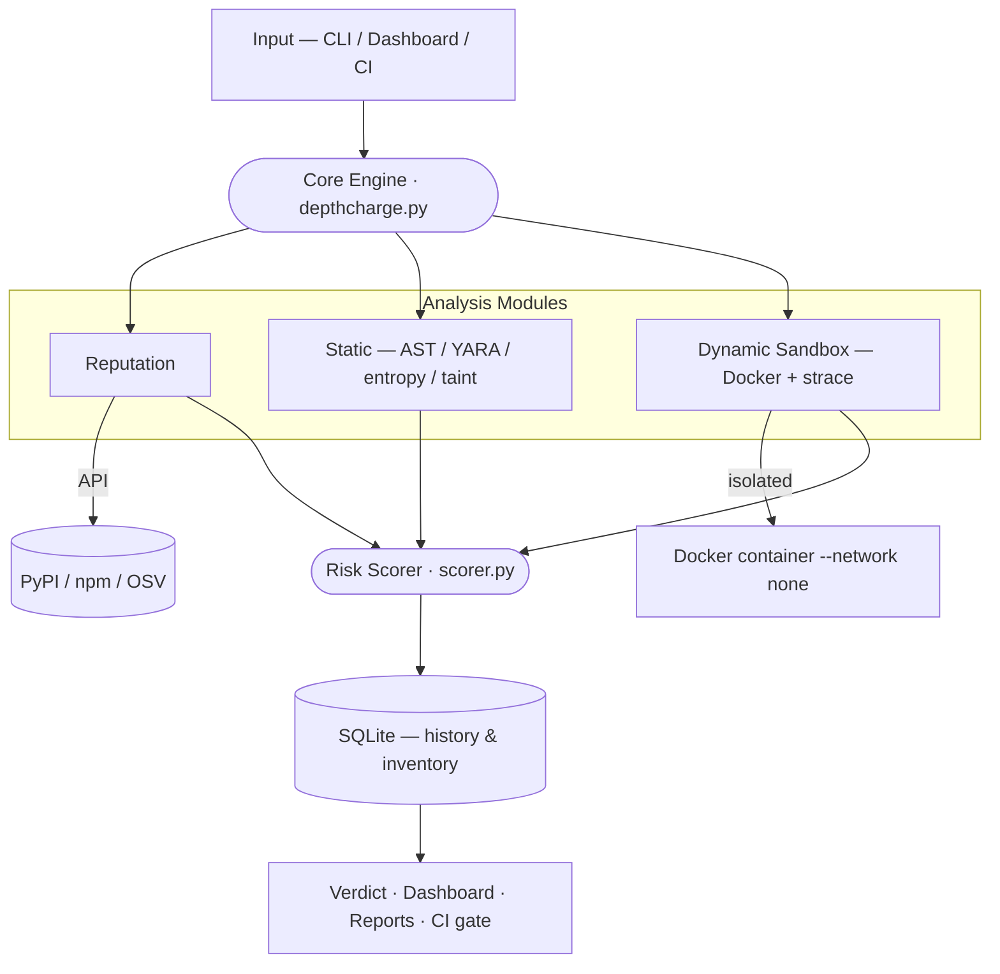

<div align="center">

# 🛡️ DepthCharge

### Multi-layer software supply chain attack detector for PyPI & npm

*Drop it on any dependency — surface the threats hidden at depth.*

[](https://www.python.org/)
[](https://www.docker.com/)
[](https://flask.palletsprojects.com/)
[](https://attack.mitre.org/)
[](#)
[](#-license)
[](#-contributors)

[**Overview**](#-overview) · [**How it works**](#-how-it-works) · [**Architecture**](#%EF%B8%8F-architecture) · [**Install**](#-installation) · [**Usage**](#-usage) · [**Demo**](#-demo) · [**Contributors**](#-contributors)

</div>

---

## 🎬 Demo

<!--
  HOW TO ADD THE DEMO VIDEO (no YouTube needed):
  1. Open this README on github.com and click the pencil (Edit) icon.
  2. Drag & drop your demo.mp4 into the editor. GitHub uploads it and inserts
     a line like:  https://github.com/user-attachments/assets/xxxxxxxx
  3. That line renders as an inline video player. Paste it just below this comment,
     then delete the placeholder line.
  If GitHub says the file is too large, compress it first (see ffmpeg tip in the PR/issue)
  or host it as an "Unlisted" YouTube video and link it here instead.
-->

<!-- ▶️ Replace this line with the github.com/user-attachments/assets/... URL after drag-and-drop -->
_Demo video coming soon — drag your `demo.mp4` into this README on GitHub to embed it._

> 🌐 **Landing page:** [depthcharge.vercel.app](https://depthcharge.vercel.app) <!-- TODO: update once deployed -->
>
> The landing page plays the demo from a self-hosted `demo.mp4` placed next to `index.html`.

<!-- Optional: add screenshots to docs/screenshots/ and uncomment below
<div align="center">
  
</div>
-->

---

## 📖 Overview

**DepthCharge** is a security analysis tool that inspects third-party dependencies (**Python / PyPI** and **JavaScript / npm**) *before* they enter a production pipeline. Modern applications pull in hundreds of transitive packages — each one a potential attack vector. A single poisoned dependency (`event-stream`, `ctx`, `XZ Utils`, mass PyPI typosquatting campaigns…) is enough to compromise thousands of downstream systems.

DepthCharge acts as a client-side firewall against **software supply chain attacks** by combining three independent detection layers into a single, actionable **risk score (0–100)**. Every finding is mapped to a **MITRE ATT&CK** technique and cross-referenced against compliance controls (**NIST SP 800-161, NIS2, DORA**).

It ships in three complementary surfaces:

- 🖥️ a scriptable **CLI** for everyday developer use,
- 📊 a real-time **web dashboard** (Flask + Server-Sent Events) for security analysts,
- 🔁 a **GitHub Actions** workflow that automatically blocks any pull request introducing a high-risk dependency.

---

## 🔍 How it works

DepthCharge runs a package through three modular scanners whose signals are aggregated by a weighted risk-scoring engine.

### 1. Reputation Engine — *metadata & intelligence*
- Queries public registries (PyPI, npm) and the **OSV** vulnerability database.
- Detects **typosquatting** via Levenshtein distance (`reqeusts` vs `requests`) and case confusion (`requesTs`).
- Flags suspiciously new packages, low release counts, and **maintainer e-mail changes** (possible account takeover).
- Cross-references known **CVEs / GHSAs**.

### 2. Static Analyzer — *AST, YARA, entropy & taint*
- Downloads the package archive and walks the source code.
- Detects dangerous **AST patterns** (`eval`, `exec`, `compile`, dangerous subprocess calls) with **install-hook context sensitivity** (`setup.py` raises severity).
- Runs **YARA** rules (Base64 eval, Discord/Telegram bot tokens, reverse-shell patterns, sensitive file paths).
- Measures **Shannon entropy** to surface obfuscated payloads, and performs intra-procedural **taint analysis** (source → sink).

### 3. Dynamic Sandbox — *isolated Docker execution tracing*
- Installs and imports the package inside a **network-isolated**, hardened Docker container (`--network none`, capped memory & PIDs, read-only mount).
- Monitors runtime behavior via **strace** (`connect`, `execve`, `open`) and **Python function instrumentation**.
- Flags egress connection attempts, sensitive-file access, and suspicious child-process spawns (e.g. `curl`/`wget` exfiltration, reverse shells).

### Risk scoring

| Score | Level | Decision |
|------:|-------|----------|
| 0 – 14 | 🟢 **Low** | Package likely safe |
| 15 – 69 | 🟠 **Medium** | Manual review recommended |
| 70 – 100 | 🔴 **High** | PR blocked automatically |

The scorer is **additive and weighted**, with **cross-layer correlation bonuses** (e.g. obfuscation *and* outbound network = more than the sum of parts) and a **strict whitelist** that suppresses false positives on trusted packages (`boto3`, `cryptography`, `scapy`…).

---

## 🏗️ Architecture

DepthCharge follows a modular pipeline architecture, decoupled by a single shared **JSON data contract** so every module can be developed and tested independently.



**Repository layout**

| Path | Responsibility |
|------|----------------|
| `modules/reputation/` | Metadata, typosquatting, OSV, version diff |
| `modules/static/` | AST analysis, YARA, entropy, taint, IoCs |
| `modules/sandbox/` | Docker sandbox, monitors, strace parser |
| `modules/dashboard/` | Flask app, REST API, web UI (SSE) |
| `modules/report/` | PDF / HTML / Markdown report generation |
| `scorer.py` | Risk-scoring engine |
| `depthcharge.py` | Orchestrator & CLI |
| `.github/workflows/` | CI/CD integration |
| `tests/` | Test suite & mock malicious packages |
| `data/` | SQLite scan history |

---

## 🎯 MITRE ATT&CK mapping

| Technique | Name | DepthCharge trigger |
|-----------|------|---------------------|
| `T1195.001` | Compromise Software Dependencies | Typosquatting, dependency confusion, known malicious package |
| `T1027` | Obfuscated Files or Information | High entropy, Base64 encoding, `chr()` reconstruction |
| `T1059.006` | Python interpreter | `eval`/`exec` in an install hook |
| `T1552` | Unsecured Credentials | AWS/GCP/Azure env vars read & transmitted |
| `T1041` | Exfiltration over C2 channel | Outbound connection detected in the sandbox |
| `T1547` | Boot/logon persistence | `sitecustomize.py` or `~/.bashrc` modification |
| `T1071` | Application layer protocol | Outbound HTTP/DNS during import |

---

## 📊 Comparison

| | Reputation / Typosquat | Static (AST / rules) | Dynamic sandbox | CVE / OSV | MITRE ATT&CK | NIST / NIS2 / DORA | CI/CD | Self-hosted / OSS |
|---|:---:|:---:|:---:|:---:|:---:|:---:|:---:|:---:|
| Dependabot / pip-audit | ✗ | ✗ | ✗ | ✓ | ✗ | ✗ | ✓ | ✓ |
| OSV-Scanner | ✗ | ✗ | ✗ | ✓ | ✗ | ✗ | ✓ | ✓ |
| Snyk | ∼ | ∼ | ✗ | ✓ | ✗ | ∼ | ✓ | ✗ |
| Socket.dev | ✓ | ✓ | ∼ | ✓ | ✗ | ∼ | ✓ | ✗ |
| GuardDog | ✓ | ✓ | ✗ | ∼ | ✗ | ✗ | ✓ | ✓ |
| **DepthCharge** | ✓ | ✓ | ✓ | ✓ | ✓ | ✓ | ✓ | ✓ |

> ✓ supported · ∼ partial · ✗ absent. DepthCharge is the only self-hostable, open-source tool combining all three analysis layers with integrated ATT&CK mapping and compliance alignment.

---

## 🚀 Installation

### Prerequisites
- **Python 3.9+**
- **Docker** (optional — required only for the dynamic sandbox; the tool degrades gracefully without it)

### Setup
```bash
git clone https://github.com/MAITO465/depthcharge.git
cd depthcharge
pip install -r requirements.txt
```

---

## 💻 Usage

### Web dashboard (recommended)
```bash
python modules/dashboard/app.py
```
Then open **http://localhost:5001** — toggle modules on/off, run asynchronous scans, watch real-time progress via SSE, and export audit reports.

### Command line
```bash
# Scan a single PyPI package
python depthcharge.py scan requests

# Scan an npm package
python depthcharge.py scan express --type npm

# Skip selected modules
python depthcharge.py scan requests --skip-reputation --skip-static

# Scan a full dependency file
python depthcharge.py scan-file requirements.txt

# View scan history
python depthcharge.py history
```

---

## 🧪 Testing

```bash
# Run the unit test suite
pytest tests/test_scanners.py

# Legitimate packages — should score 0/100 (Low)
python depthcharge.py scan-file tests/test_packages/legit_packages.txt --skip-dynamic

# Known malware & typosquats — should score >= 70/100 (High)
python depthcharge.py scan-file tests/test_packages/malware_packages.txt --skip-dynamic

# Dynamic sandbox on local mock malware (safe, no live PyPI needed)
python depthcharge.py scan "file://$(pwd)/tests/test_packages/dynamic_malware/dist/evil_dynamic-1.0.0.tar.gz"
python depthcharge.py scan "file://$(pwd)/tests/test_packages/dynamic_malware/dist/evil_curl_exfil-1.0.0.tar.gz"
```

---

## ⚙️ CI/CD integration

A pre-configured GitHub Actions workflow lives at `.github/workflows/security-scan.yml`. It runs on every `push` or `pull_request` that touches `requirements.txt` or `package.json`, and **fails the build** if any package scores ≥ 70.

```yaml
name: DepthCharge Security Scan
on: [push, pull_request]

jobs:
  security-audit:
    runs-on: ubuntu-latest
    steps:
      - uses: actions/checkout@v4
      - uses: actions/setup-python@v5
        with:
          python-version: '3.10'
      - name: Install DepthCharge
        run: pip install -r requirements.txt
      - name: Audit dependencies
        run: python depthcharge.py scan-file requirements.txt --threshold 70 --fail-on-high --skip-dynamic
```

> Dynamic scanning is skipped in standard CI unless you configure Docker-in-Docker.

---

## 📜 Compliance

DepthCharge maps each detection to recognized regulatory frameworks, giving findings an operational reach beyond pure technical use:

- **NIST SP 800-161** — Cybersecurity Supply Chain Risk Management (C-SCRM)
- **NIS2** (EU 2022/2555) — supply chain security as a risk-management obligation (Art. 21)
- **DORA** (EU 2022/2554) — ICT third-party risk management for financial entities (Art. 30)

Audit reports are exportable to **HTML, Markdown and PDF** for stakeholders and compliance reviews.

---

## 🔮 Roadmap

- [ ] **Empirical evaluation** — benchmark against GuardDog on a labeled corpus (precision / recall / FP rate)
- [ ] **eBPF kernel tracing** — stealthier, harder-to-detect sandbox monitoring
- [ ] **Dormant-payload resilience** — clock manipulation & longer observation windows
- [ ] **LLM-assisted de-obfuscation** — intent hypothesis for obfuscated payloads
- [ ] **Runtime monitoring** — pair with Falco for post-install protection
- [ ] **More ecosystems** — RubyGems & Crates.io
- [ ] **Automated remediation** — auto-PRs to downgrade/replace malicious packages

---

## 👥 Contributors

Built by a four-member team in the **Génie Cyber-Défense & Systèmes de Télécommunications Embarqués** program at **ENSA Marrakech — Université Cadi Ayyad** (2025–2026).

<table>
  <tr>
    <td align="center" width="25%">
      <a href="https://github.com/yasser-ch"><br/><sub><b>Yasser Chettour</b></sub></a><br/>
      <sub>CI/CD · Risk Scoring · Dashboard</sub>
    </td>
    <td align="center" width="25%">
      <a href="https://github.com/MAITO465"><br/><sub><b>Mohamed Ait Ourajli</b></sub></a><br/>
      <sub>Dynamic Sandbox Analysis</sub>
    </td>
    <td align="center" width="25%">
      <!-- TODO: replace GITHUB_YOUSSRA with Youssra's GitHub handle -->
      <a href="https://github.com/GITHUB_YOUSSRA"><br/><sub><b>Youssra Zarri</b></sub></a><br/>
      <sub>Static Analysis (AST / YARA)</sub>
    </td>
    <td align="center" width="25%">
      <!-- TODO: replace GITHUB_WIAM with Wiam's GitHub handle -->
      <a href="https://github.com/GITHUB_WIAM"><br/><sub><b>Wiam Baba</b></sub></a><br/>
      <sub>Reputation & Intelligence</sub>
    </td>
  </tr>
</table>

**Supervisor:** M. Abdelghafour Atlas — ENSA Marrakech

---

## 📄 License

Released under the **MIT License**. <!-- TODO: add a LICENSE file to the repo root -->

---

<div align="center">
<sub>DepthCharge · ENSA Marrakech · 2025–2026 · For research and educational use.</sub>
</div>
